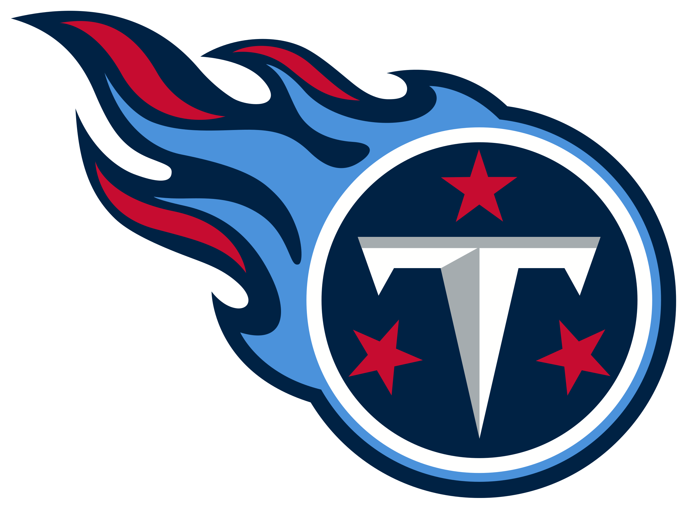

# chickenstats-blog

<!-- WARNING: THIS FILE WAS AUTOGENERATED! DO NOT EDIT! -->

Welcome to the blog for chickenstats. Here you can find examples for the
`chickenstats` library and the code used for the [chicken and
stats](https://chickenandstats.com) newsletter

# Projects

Follow the links below to the different projects in the chickenstats
portfolio

### chickenstats

### chickenstats-xg

### chickenstats-api

### chicken and stats

## Blog

Read posts for the respective topics

### Nashville Predators

### Tennessee Titans

### Tennessee Volunteers

## About

### About me

I’m chicken.

