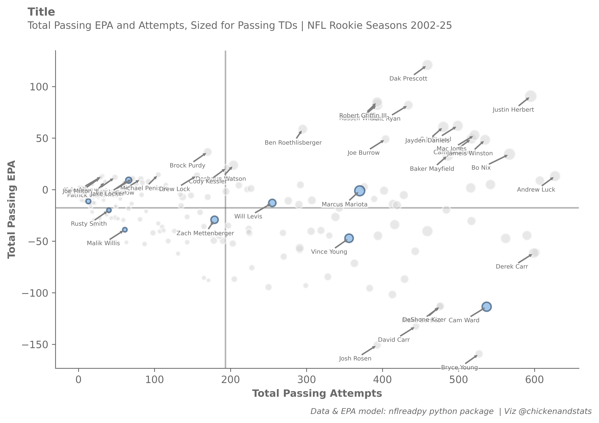

# How does Cam Ward stack up?
chicken
2025-12-26

<!-- WARNING: THIS FILE WAS AUTOGENERATED! DO NOT EDIT! -->


## Housekeeping

### Import dependencies and set options

``` python
# chickenstats library and utilities
from chickenstats.chicken_nhl._helpers import charts_directory

import nflreadpy as nfl

import polars as pl


# plotting library and utilities
import matplotlib.pyplot as plt
import seaborn as sns

# miscellaneous utilities
from pathlib import Path
```

``` python
pl.Config.set_tbl_cols(-1)
pl.Config.set_tbl_rows(30)
```

    polars.config.Config

### Create directory for charts

``` python
charts_directory()
```

### chickenstats matplotlib styles

``` python
plt.style.use("chickenstats")  # this is available when you import chickenstats.utilities
```

## Downloading and prepping data

### Player stats

``` python
seasons = list(range(2002, 2026))

player_stats = nfl.load_player_stats(seasons=seasons)
```

``` python
conditions = (pl.col("player_id") != "0", pl.col("player_name").is_not_null())

player_stats = player_stats.filter(conditions)
```

### Rosters

``` python
rosters = nfl.load_rosters_weekly(seasons=seasons)
```

``` python
rosters = rosters.filter(pl.col("status") == "ACT")
```

### Adding years of experience

``` python
columns = (pl.col("season"), pl.col("gsis_id").alias("player_id"), pl.col("week"), pl.col("years_exp"))

merge_columns = ["season", "player_id", "week"]

player_stats = player_stats.join(rosters.select(columns), on=merge_columns)
```

### Aggregating to season level

``` python
group_columns = [
    "player_id",
    "player_name",
    "player_display_name",
    "position",
    "position_group",
    "season",
    "season_type",
    "team",
    "years_exp",
]

group_columns = (pl.col(x) for x in group_columns)

sum_columns = [
    "completions",
    "attempts",
    "passing_yards",
    "passing_tds",
    "passing_interceptions",
    "sacks_suffered",
    "sack_yards_lost",
    "sack_fumbles",
    "sack_fumbles_lost",
    "passing_air_yards",
    "passing_yards_after_catch",
    "passing_first_downs",
    "passing_epa",
    "passing_2pt_conversions",
    "carries",
    "rushing_yards",
    "rushing_tds",
    "rushing_fumbles",
    "rushing_fumbles_lost",
    "rushing_first_downs",
    "rushing_epa",
    "rushing_2pt_conversions",
    "receptions",
    "targets",
    "receiving_yards",
    "receiving_tds",
    "receiving_fumbles",
    "receiving_fumbles_lost",
    "receiving_air_yards",
    "receiving_yards_after_catch",
    "receiving_first_downs",
    "receiving_epa",
    "receiving_2pt_conversions",
    "special_teams_tds",
    "def_tackles_solo",
    "def_tackles_with_assist",
    "def_tackle_assists",
    "def_tackles_for_loss",
    "def_tackles_for_loss_yards",
    "def_fumbles_forced",
    "def_sacks",
    "def_sack_yards",
    "def_qb_hits",
    "def_interceptions",
    "def_interception_yards",
    "def_pass_defended",
    "def_tds",
    "def_fumbles",
    "def_safeties",
    "misc_yards",
    "fumble_recovery_own",
    "fumble_recovery_yards_own",
    "fumble_recovery_opp",
    "fumble_recovery_yards_opp",
    "fumble_recovery_tds",
    "penalties",
    "penalty_yards",
    "punt_returns",
    "punt_return_yards",
    "kickoff_returns",
    "kickoff_return_yards",
    "fg_made",
    "fg_att",
    "fg_missed",
    "fg_blocked",
    "fg_long",
    "fg_made_0_19",
    "fg_made_20_29",
    "fg_made_30_39",
    "fg_made_40_49",
    "fg_made_50_59",
    "fg_made_60_",
    "fg_missed_0_19",
    "fg_missed_20_29",
    "fg_missed_30_39",
    "fg_missed_40_49",
    "fg_missed_50_59",
    "fg_missed_60_",
    "pat_made",
    "pat_att",
    "pat_missed",
    "pat_blocked",
    "pat_pct",
    "gwfg_made",
    "gwfg_att",
    "gwfg_missed",
    "gwfg_blocked",
    "gwfg_distance",
    "fantasy_points",
    "fantasy_points_ppr",
]

sum_columns = (pl.col(x).sum().alias(f"{x}_sum") for x in sum_columns)

mean_columns = ["passing_cpoe", "target_share", "air_yards_share", "pacr", "racr", "wopr"]

mean_columns = (pl.col(x).mean().alias(f"{x}_mean") for x in mean_columns)

agg_columns = (*sum_columns, *mean_columns)


player_stats = player_stats.group_by(group_columns).agg(agg_columns)
```

### Getting QB stats

``` python
conditions = (
    pl.col("player_id") != "0",
    pl.col("player_name").is_not_null(),
    pl.col("position") == "QB",
    pl.col("attempts_sum") >= 1,
    pl.col("season_type") == "REG",
    pl.col("years_exp") == 0,
)

qb_stats = player_stats.filter(conditions)
```

``` python
qb_stats = qb_stats.with_columns(epa_per_attempt=pl.col("passing_epa_sum") / pl.col("attempts_sum"))
```

## Plotting data

### Setting team and other values

``` python
team = "TEN"
light_blue = "#4B92DB"
navy = "#002244"
red = "#C60C30"
gray = "#D3D3D3"
```

### Scatter plot

``` python
# Setting overall figures
fig, ax = plt.subplots(dpi=650, figsize=(8, 5))

# Aesthetics, likes the tight layout and despining axes
fig.tight_layout()
sns.despine()

# Setting the x, y, and z values

x_col = "attempts_sum"
y_col = "passing_epa_sum"
size_col = "passing_tds_sum"

# Getting the averages and drawing the average lines
x_mean = qb_stats.select(pl.col(x_col)).mean().item(0, 0)
y_mean = qb_stats.select(pl.col(y_col)).mean().item(0, 0)

ax.axvline(x=x_mean, zorder=-1, alpha=0.5)
ax.axhline(y=y_mean, zorder=-1, alpha=0.5)

# Setting the size norm so bubbles are consistent across figures
size_min = qb_stats.select(pl.col(size_col)).min().item(0, 0)
size_max = qb_stats.select(pl.col(size_col)).max().item(0, 0)

size_norm = (size_min, size_max)
sizes = (20, 150)

# Filtering data and plotting the non-selected teams first
plot_data = qb_stats.filter(pl.col("team") != team)

# They all get gray colors
facecolor = gray
edgecolor = "white"

# Plotting the non-selected teams' data
sns.scatterplot(
    x=plot_data[x_col],
    y=plot_data[y_col],
    size=plot_data[size_col],
    sizes=sizes,
    size_norm=size_norm,
    lw=1.5,
    facecolor=facecolor,
    edgecolor=edgecolor,
    alpha=0.5,
    legend=False,
)

# Filtering the data and plotting the selected team
plot_data = qb_stats.filter(pl.col("team") == team)

# Setting the colors
facecolor = light_blue
edgecolor = navy

# Plotting the selected teams' data
sns.scatterplot(
    x=plot_data[x_col],
    y=plot_data[y_col],
    size=plot_data[size_col],
    sizes=sizes,
    size_norm=size_norm,
    lw=1.5,
    facecolor=facecolor,
    edgecolor=edgecolor,
    alpha=0.5,
    legend=False,
)

# Labeling Cam Ward

player_list = [
    "C.Ward",
    "P.Mahomes",
    "R.Wilson",
    "J.Burrow",
    "D.Prescott",
    "J.Herbert",
    "R.Griffin",
    "M.Ryan",
    "C.Stroud",
    "J.Daniels",
    "B.Roethlisberger",
    "M.Jones",
    "C.Newton",
    "J.Burrow",
    "J.Winston",
    "B.Purdy",
    "B.Nix",
    "B.Mayfield",
    "D.Watson",
    "C.Kessler",
    "M.Penix",
    "D.Lock",
    "A.Luck",
    "K.Allen",
    "K.Cousins",
    "J.Milton",
    "T.Lance",
    "T.Tebow",
    "J.Locker",
    "M.Mariota",
    "W.Levis",
    "R.Smith",
    "Z.Mettenberger",
    "M.Willis",
    "V.Young",
    "B.Young",
    "J.Rosen",
    "D.Carr",
    "B.Bortles",
    "D.Kizer",
]

label_data = qb_stats.filter(pl.col("player_name").is_in(player_list), pl.col("years_exp") == 0)

x_offset = -50
y_offset = -15

for player_data in label_data.iter_rows(named=True):
    x_position = player_data[x_col] + x_offset
    y_position = player_data[y_col] + y_offset

    arrow_props = {"arrowstyle": "simple", "linewidth": 0.25, "color": "tab:gray"}

    # Plotting the annotation
    ax.annotate(
        text=f"{player_data['player_display_name']}",
        xy=(player_data[x_col], player_data[y_col]),
        xytext=(x_position, y_position),
        fontsize=6,
        bbox={"facecolor": "white", "alpha": 0.5, "edgecolor": "white", "pad": 0},
        arrowprops=arrow_props,
    )

# Iterating through the dataframe to label the bubbles
# for row, player in plot_data.iterrows():
#     # Setting x and y positions that are slightly offset from the data they point to
#     x_position = player.xga_p60 + 0.25
#     y_position = player.xgf_p60 - 0.25

#     # Annotation options
#     arrow_props = {"arrowstyle": "simple", "linewidth": 0.25, "color": "tab:gray"}

#     # Plotting the annotation
#     ax.annotate(
#         text=f"{player.player}",
#         xy=(player.xga_p60, player.xgf_p60),
#         xytext=(x_position, y_position),
#         fontsize=6,
#         bbox={"facecolor": "white", "alpha": 0.5, "edgecolor": "white", "pad": 0},
#         arrowprops=arrow_props,
#     )

# Setting axis lables
ax.axes.set_xlabel("Total Passing Attempts")
ax.axes.set_ylabel("Total Passing EPA")

# Setting figure suptitle and subtitle
fig_suptitle = "Title"
fig.suptitle(fig_suptitle, x=0.01, y=1.08, fontsize=11, fontweight="bold", horizontalalignment="left")

subtitle = "Total Passing EPA and Attempts, Sized for Passing TDs | NFL Rookie Seasons 2002-25"
fig.text(s=subtitle, x=0.01, y=1.02, fontsize=10, horizontalalignment="left")

# Attribution
attribution = "Data & EPA model: nflreadpy python package  | Viz @chickenandstats"
fig.text(s=attribution, x=0.99, y=-0.05, fontsize=8, horizontalalignment="right", style="italic")

# Save figure
savepath = Path(f"./charts/epa_attempt_attempts_{team}.png")
# fig.savefig(savepath, transparent=False, bbox_inches="tight")
```



``` python
qb_stats.filter(pl.col("player_name").str.contains("V.Young"))
# qb_stats.sort("passing_epa_sum", descending=True).head(25)["player_name"].unique().to_list()
qb_stats.filter(pl.col("years_exp") == 0).sort("passing_epa_sum", descending=True).tail(25)
```

<div><style>
.dataframe > thead > tr,
.dataframe > tbody > tr {
  text-align: right;
  white-space: pre-wrap;
}
</style>
<small>shape: (25, 106)</small>

<table class="dataframe" data-quarto-postprocess="true" data-border="1">
<thead>
<tr>
<th data-quarto-table-cell-role="th">player_id</th>
<th data-quarto-table-cell-role="th">player_name</th>
<th data-quarto-table-cell-role="th">player_display_name</th>
<th data-quarto-table-cell-role="th">position</th>
<th data-quarto-table-cell-role="th">position_group</th>
<th data-quarto-table-cell-role="th">season</th>
<th data-quarto-table-cell-role="th">season_type</th>
<th data-quarto-table-cell-role="th">team</th>
<th data-quarto-table-cell-role="th">years_exp</th>
<th data-quarto-table-cell-role="th">completions_sum</th>
<th data-quarto-table-cell-role="th">attempts_sum</th>
<th data-quarto-table-cell-role="th">passing_yards_sum</th>
<th data-quarto-table-cell-role="th">passing_tds_sum</th>
<th data-quarto-table-cell-role="th">passing_interceptions_sum</th>
<th data-quarto-table-cell-role="th">sacks_suffered_sum</th>
<th data-quarto-table-cell-role="th">sack_yards_lost_sum</th>
<th data-quarto-table-cell-role="th">sack_fumbles_sum</th>
<th data-quarto-table-cell-role="th">sack_fumbles_lost_sum</th>
<th data-quarto-table-cell-role="th">passing_air_yards_sum</th>
<th data-quarto-table-cell-role="th">passing_yards_after_catch_sum</th>
<th data-quarto-table-cell-role="th">passing_first_downs_sum</th>
<th data-quarto-table-cell-role="th">passing_epa_sum</th>
<th data-quarto-table-cell-role="th">passing_2pt_conversions_sum</th>
<th data-quarto-table-cell-role="th">carries_sum</th>
<th data-quarto-table-cell-role="th">rushing_yards_sum</th>
<th data-quarto-table-cell-role="th">rushing_tds_sum</th>
<th data-quarto-table-cell-role="th">rushing_fumbles_sum</th>
<th data-quarto-table-cell-role="th">rushing_fumbles_lost_sum</th>
<th data-quarto-table-cell-role="th">rushing_first_downs_sum</th>
<th data-quarto-table-cell-role="th">rushing_epa_sum</th>
<th data-quarto-table-cell-role="th">rushing_2pt_conversions_sum</th>
<th data-quarto-table-cell-role="th">receptions_sum</th>
<th data-quarto-table-cell-role="th">targets_sum</th>
<th data-quarto-table-cell-role="th">receiving_yards_sum</th>
<th data-quarto-table-cell-role="th">receiving_tds_sum</th>
<th data-quarto-table-cell-role="th">receiving_fumbles_sum</th>
<th data-quarto-table-cell-role="th">receiving_fumbles_lost_sum</th>
<th data-quarto-table-cell-role="th">receiving_air_yards_sum</th>
<th
data-quarto-table-cell-role="th">receiving_yards_after_catch_sum</th>
<th data-quarto-table-cell-role="th">receiving_first_downs_sum</th>
<th data-quarto-table-cell-role="th">receiving_epa_sum</th>
<th data-quarto-table-cell-role="th">receiving_2pt_conversions_sum</th>
<th data-quarto-table-cell-role="th">special_teams_tds_sum</th>
<th data-quarto-table-cell-role="th">def_tackles_solo_sum</th>
<th data-quarto-table-cell-role="th">def_tackles_with_assist_sum</th>
<th data-quarto-table-cell-role="th">def_tackle_assists_sum</th>
<th data-quarto-table-cell-role="th">def_tackles_for_loss_sum</th>
<th data-quarto-table-cell-role="th">def_tackles_for_loss_yards_sum</th>
<th data-quarto-table-cell-role="th">def_fumbles_forced_sum</th>
<th data-quarto-table-cell-role="th">def_sacks_sum</th>
<th data-quarto-table-cell-role="th">def_sack_yards_sum</th>
<th data-quarto-table-cell-role="th">def_qb_hits_sum</th>
<th data-quarto-table-cell-role="th">def_interceptions_sum</th>
<th data-quarto-table-cell-role="th">def_interception_yards_sum</th>
<th data-quarto-table-cell-role="th">def_pass_defended_sum</th>
<th data-quarto-table-cell-role="th">def_tds_sum</th>
<th data-quarto-table-cell-role="th">def_fumbles_sum</th>
<th data-quarto-table-cell-role="th">def_safeties_sum</th>
<th data-quarto-table-cell-role="th">misc_yards_sum</th>
<th data-quarto-table-cell-role="th">fumble_recovery_own_sum</th>
<th data-quarto-table-cell-role="th">fumble_recovery_yards_own_sum</th>
<th data-quarto-table-cell-role="th">fumble_recovery_opp_sum</th>
<th data-quarto-table-cell-role="th">fumble_recovery_yards_opp_sum</th>
<th data-quarto-table-cell-role="th">fumble_recovery_tds_sum</th>
<th data-quarto-table-cell-role="th">penalties_sum</th>
<th data-quarto-table-cell-role="th">penalty_yards_sum</th>
<th data-quarto-table-cell-role="th">punt_returns_sum</th>
<th data-quarto-table-cell-role="th">punt_return_yards_sum</th>
<th data-quarto-table-cell-role="th">kickoff_returns_sum</th>
<th data-quarto-table-cell-role="th">kickoff_return_yards_sum</th>
<th data-quarto-table-cell-role="th">fg_made_sum</th>
<th data-quarto-table-cell-role="th">fg_att_sum</th>
<th data-quarto-table-cell-role="th">fg_missed_sum</th>
<th data-quarto-table-cell-role="th">fg_blocked_sum</th>
<th data-quarto-table-cell-role="th">fg_long_sum</th>
<th data-quarto-table-cell-role="th">fg_made_0_19_sum</th>
<th data-quarto-table-cell-role="th">fg_made_20_29_sum</th>
<th data-quarto-table-cell-role="th">fg_made_30_39_sum</th>
<th data-quarto-table-cell-role="th">fg_made_40_49_sum</th>
<th data-quarto-table-cell-role="th">fg_made_50_59_sum</th>
<th data-quarto-table-cell-role="th">fg_made_60__sum</th>
<th data-quarto-table-cell-role="th">fg_missed_0_19_sum</th>
<th data-quarto-table-cell-role="th">fg_missed_20_29_sum</th>
<th data-quarto-table-cell-role="th">fg_missed_30_39_sum</th>
<th data-quarto-table-cell-role="th">fg_missed_40_49_sum</th>
<th data-quarto-table-cell-role="th">fg_missed_50_59_sum</th>
<th data-quarto-table-cell-role="th">fg_missed_60__sum</th>
<th data-quarto-table-cell-role="th">pat_made_sum</th>
<th data-quarto-table-cell-role="th">pat_att_sum</th>
<th data-quarto-table-cell-role="th">pat_missed_sum</th>
<th data-quarto-table-cell-role="th">pat_blocked_sum</th>
<th data-quarto-table-cell-role="th">pat_pct_sum</th>
<th data-quarto-table-cell-role="th">gwfg_made_sum</th>
<th data-quarto-table-cell-role="th">gwfg_att_sum</th>
<th data-quarto-table-cell-role="th">gwfg_missed_sum</th>
<th data-quarto-table-cell-role="th">gwfg_blocked_sum</th>
<th data-quarto-table-cell-role="th">gwfg_distance_sum</th>
<th data-quarto-table-cell-role="th">fantasy_points_sum</th>
<th data-quarto-table-cell-role="th">fantasy_points_ppr_sum</th>
<th data-quarto-table-cell-role="th">passing_cpoe_mean</th>
<th data-quarto-table-cell-role="th">target_share_mean</th>
<th data-quarto-table-cell-role="th">air_yards_share_mean</th>
<th data-quarto-table-cell-role="th">pacr_mean</th>
<th data-quarto-table-cell-role="th">racr_mean</th>
<th data-quarto-table-cell-role="th">wopr_mean</th>
<th data-quarto-table-cell-role="th">epa_per_attempt</th>
</tr>
<tr>
<th>str</th>
<th>str</th>
<th>str</th>
<th>str</th>
<th>str</th>
<th>i32</th>
<th>str</th>
<th>str</th>
<th>i32</th>
<th>i32</th>
<th>i32</th>
<th>i32</th>
<th>i32</th>
<th>i32</th>
<th>i32</th>
<th>i32</th>
<th>i32</th>
<th>i32</th>
<th>i32</th>
<th>i32</th>
<th>i32</th>
<th>f64</th>
<th>i32</th>
<th>i32</th>
<th>i32</th>
<th>i32</th>
<th>i32</th>
<th>i32</th>
<th>i32</th>
<th>f64</th>
<th>i32</th>
<th>i32</th>
<th>i32</th>
<th>i32</th>
<th>i32</th>
<th>i32</th>
<th>i32</th>
<th>i32</th>
<th>i32</th>
<th>i32</th>
<th>f64</th>
<th>i32</th>
<th>i32</th>
<th>i32</th>
<th>i32</th>
<th>i32</th>
<th>i32</th>
<th>i32</th>
<th>i32</th>
<th>f64</th>
<th>f64</th>
<th>i32</th>
<th>i32</th>
<th>i32</th>
<th>i32</th>
<th>i32</th>
<th>i32</th>
<th>i32</th>
<th>i32</th>
<th>i32</th>
<th>i32</th>
<th>i32</th>
<th>i32</th>
<th>i32</th>
<th>i32</th>
<th>i32</th>
<th>i32</th>
<th>i32</th>
<th>i32</th>
<th>i32</th>
<th>i32</th>
<th>i32</th>
<th>i32</th>
<th>i32</th>
<th>i32</th>
<th>i32</th>
<th>i32</th>
<th>i32</th>
<th>i32</th>
<th>i32</th>
<th>i32</th>
<th>i32</th>
<th>i32</th>
<th>i32</th>
<th>i32</th>
<th>i32</th>
<th>i32</th>
<th>i32</th>
<th>i32</th>
<th>i32</th>
<th>i32</th>
<th>f64</th>
<th>i32</th>
<th>i32</th>
<th>i32</th>
<th>i32</th>
<th>i32</th>
<th>f64</th>
<th>f64</th>
<th>f64</th>
<th>f64</th>
<th>f64</th>
<th>f64</th>
<th>f64</th>
<th>f64</th>
<th>f64</th>
</tr>
</thead>
<tbody>
<tr>
<td>"00-0035652"</td>
<td>"R.Finley"</td>
<td>"Ryan Finley"</td>
<td>"QB"</td>
<td>"QB"</td>
<td>2019</td>
<td>"REG"</td>
<td>"CIN"</td>
<td>0</td>
<td>41</td>
<td>87</td>
<td>474</td>
<td>2</td>
<td>2</td>
<td>11</td>
<td>-93</td>
<td>4</td>
<td>3</td>
<td>721</td>
<td>203</td>
<td>20</td>
<td>-52.636759</td>
<td>0</td>
<td>10</td>
<td>77</td>
<td>0</td>
<td>0</td>
<td>0</td>
<td>5</td>
<td>0.280104</td>
<td>0</td>
<td>0</td>
<td>0</td>
<td>0</td>
<td>0</td>
<td>0</td>
<td>0</td>
<td>0</td>
<td>0</td>
<td>0</td>
<td>0.0</td>
<td>0</td>
<td>0</td>
<td>0</td>
<td>0</td>
<td>0</td>
<td>0</td>
<td>0</td>
<td>0</td>
<td>0.0</td>
<td>0.0</td>
<td>0</td>
<td>0</td>
<td>0</td>
<td>0</td>
<td>0</td>
<td>0</td>
<td>0</td>
<td>0</td>
<td>1</td>
<td>1</td>
<td>0</td>
<td>0</td>
<td>0</td>
<td>0</td>
<td>0</td>
<td>0</td>
<td>0</td>
<td>0</td>
<td>0</td>
<td>0</td>
<td>0</td>
<td>0</td>
<td>0</td>
<td>0</td>
<td>0</td>
<td>0</td>
<td>0</td>
<td>0</td>
<td>0</td>
<td>0</td>
<td>0</td>
<td>0</td>
<td>0</td>
<td>0</td>
<td>0</td>
<td>0</td>
<td>0</td>
<td>0</td>
<td>0</td>
<td>0</td>
<td>0.0</td>
<td>0</td>
<td>0</td>
<td>0</td>
<td>0</td>
<td>0</td>
<td>24.66</td>
<td>24.66</td>
<td>-15.687838</td>
<td>0.0</td>
<td>0.0</td>
<td>0.65507</td>
<td>null</td>
<td>0.0</td>
<td>-0.60502</td>
</tr>
<tr>
<td>"00-0027950"</td>
<td>"C.Ponder"</td>
<td>"Christian Ponder"</td>
<td>"QB"</td>
<td>"QB"</td>
<td>2011</td>
<td>"REG"</td>
<td>"MIN"</td>
<td>0</td>
<td>158</td>
<td>291</td>
<td>1853</td>
<td>13</td>
<td>13</td>
<td>30</td>
<td>-164</td>
<td>5</td>
<td>2</td>
<td>2667</td>
<td>831</td>
<td>91</td>
<td>-56.446926</td>
<td>0</td>
<td>28</td>
<td>219</td>
<td>0</td>
<td>1</td>
<td>0</td>
<td>15</td>
<td>17.573881</td>
<td>0</td>
<td>0</td>
<td>0</td>
<td>0</td>
<td>0</td>
<td>0</td>
<td>0</td>
<td>0</td>
<td>0</td>
<td>0</td>
<td>0.0</td>
<td>0</td>
<td>0</td>
<td>2</td>
<td>0</td>
<td>0</td>
<td>0</td>
<td>0</td>
<td>0</td>
<td>0.0</td>
<td>0.0</td>
<td>0</td>
<td>0</td>
<td>0</td>
<td>0</td>
<td>0</td>
<td>0</td>
<td>0</td>
<td>0</td>
<td>0</td>
<td>1</td>
<td>0</td>
<td>0</td>
<td>0</td>
<td>2</td>
<td>25</td>
<td>0</td>
<td>0</td>
<td>0</td>
<td>0</td>
<td>0</td>
<td>0</td>
<td>0</td>
<td>0</td>
<td>0</td>
<td>0</td>
<td>0</td>
<td>0</td>
<td>0</td>
<td>0</td>
<td>0</td>
<td>0</td>
<td>0</td>
<td>0</td>
<td>0</td>
<td>0</td>
<td>0</td>
<td>0</td>
<td>0</td>
<td>0</td>
<td>0</td>
<td>0.0</td>
<td>0</td>
<td>0</td>
<td>0</td>
<td>0</td>
<td>0</td>
<td>118.02</td>
<td>118.02</td>
<td>-7.464352</td>
<td>0.0</td>
<td>0.0</td>
<td>0.691941</td>
<td>null</td>
<td>0.0</td>
<td>-0.193976</td>
</tr>
<tr>
<td>"00-0026993"</td>
<td>"J.Freeman"</td>
<td>"Josh Freeman"</td>
<td>"QB"</td>
<td>"QB"</td>
<td>2009</td>
<td>"REG"</td>
<td>"TB"</td>
<td>0</td>
<td>159</td>
<td>291</td>
<td>1857</td>
<td>10</td>
<td>18</td>
<td>19</td>
<td>-102</td>
<td>5</td>
<td>1</td>
<td>2649</td>
<td>658</td>
<td>89</td>
<td>-58.254535</td>
<td>1</td>
<td>31</td>
<td>162</td>
<td>0</td>
<td>4</td>
<td>1</td>
<td>15</td>
<td>2.430892</td>
<td>1</td>
<td>0</td>
<td>0</td>
<td>1</td>
<td>0</td>
<td>0</td>
<td>0</td>
<td>0</td>
<td>0</td>
<td>0</td>
<td>0.0</td>
<td>0</td>
<td>0</td>
<td>0</td>
<td>0</td>
<td>0</td>
<td>0</td>
<td>0</td>
<td>0</td>
<td>0.0</td>
<td>0.0</td>
<td>0</td>
<td>0</td>
<td>0</td>
<td>0</td>
<td>0</td>
<td>0</td>
<td>0</td>
<td>0</td>
<td>5</td>
<td>7</td>
<td>0</td>
<td>0</td>
<td>0</td>
<td>3</td>
<td>15</td>
<td>0</td>
<td>0</td>
<td>0</td>
<td>0</td>
<td>0</td>
<td>0</td>
<td>0</td>
<td>0</td>
<td>0</td>
<td>0</td>
<td>0</td>
<td>0</td>
<td>0</td>
<td>0</td>
<td>0</td>
<td>0</td>
<td>0</td>
<td>0</td>
<td>0</td>
<td>0</td>
<td>0</td>
<td>0</td>
<td>0</td>
<td>0</td>
<td>0</td>
<td>0.0</td>
<td>0</td>
<td>0</td>
<td>0</td>
<td>0</td>
<td>0</td>
<td>94.58</td>
<td>94.58</td>
<td>-4.683177</td>
<td>0.0</td>
<td>0.0</td>
<td>0.733723</td>
<td>0.0</td>
<td>0.0</td>
<td>-0.200187</td>
</tr>
<tr>
<td>"00-0030565"</td>
<td>"G.Smith"</td>
<td>"Geno Smith"</td>
<td>"QB"</td>
<td>"QB"</td>
<td>2013</td>
<td>"REG"</td>
<td>"NYJ"</td>
<td>0</td>
<td>247</td>
<td>443</td>
<td>3046</td>
<td>12</td>
<td>21</td>
<td>43</td>
<td>-315</td>
<td>4</td>
<td>3</td>
<td>3963</td>
<td>1260</td>
<td>143</td>
<td>-59.77581</td>
<td>0</td>
<td>72</td>
<td>366</td>
<td>6</td>
<td>4</td>
<td>1</td>
<td>28</td>
<td>14.142214</td>
<td>0</td>
<td>1</td>
<td>1</td>
<td>13</td>
<td>0</td>
<td>0</td>
<td>0</td>
<td>13</td>
<td>0</td>
<td>1</td>
<td>1.309993</td>
<td>0</td>
<td>0</td>
<td>0</td>
<td>0</td>
<td>0</td>
<td>0</td>
<td>0</td>
<td>0</td>
<td>0.0</td>
<td>0.0</td>
<td>0</td>
<td>0</td>
<td>0</td>
<td>0</td>
<td>0</td>
<td>0</td>
<td>0</td>
<td>0</td>
<td>3</td>
<td>4</td>
<td>0</td>
<td>0</td>
<td>0</td>
<td>5</td>
<td>21</td>
<td>0</td>
<td>0</td>
<td>0</td>
<td>0</td>
<td>0</td>
<td>0</td>
<td>0</td>
<td>0</td>
<td>0</td>
<td>0</td>
<td>0</td>
<td>0</td>
<td>0</td>
<td>0</td>
<td>0</td>
<td>0</td>
<td>0</td>
<td>0</td>
<td>0</td>
<td>0</td>
<td>0</td>
<td>0</td>
<td>0</td>
<td>0</td>
<td>0</td>
<td>0.0</td>
<td>0</td>
<td>0</td>
<td>0</td>
<td>0</td>
<td>0</td>
<td>193.74</td>
<td>194.74</td>
<td>-4.97212</td>
<td>0.002604</td>
<td>0.002871</td>
<td>0.874442</td>
<td>1.0</td>
<td>0.005916</td>
<td>-0.134934</td>
</tr>
<tr>
<td>"00-0036971"</td>
<td>"T.Lawrence"</td>
<td>"Trevor Lawrence"</td>
<td>"QB"</td>
<td>"QB"</td>
<td>2021</td>
<td>"REG"</td>
<td>"JAX"</td>
<td>0</td>
<td>359</td>
<td>602</td>
<td>3641</td>
<td>12</td>
<td>17</td>
<td>32</td>
<td>-238</td>
<td>6</td>
<td>5</td>
<td>4738</td>
<td>1634</td>
<td>178</td>
<td>-60.74786</td>
<td>2</td>
<td>73</td>
<td>334</td>
<td>2</td>
<td>2</td>
<td>0</td>
<td>23</td>
<td>11.314142</td>
<td>0</td>
<td>0</td>
<td>0</td>
<td>0</td>
<td>0</td>
<td>0</td>
<td>0</td>
<td>0</td>
<td>0</td>
<td>0</td>
<td>0.0</td>
<td>0</td>
<td>0</td>
<td>2</td>
<td>0</td>
<td>0</td>
<td>0</td>
<td>0</td>
<td>0</td>
<td>0.0</td>
<td>0.0</td>
<td>0</td>
<td>0</td>
<td>0</td>
<td>0</td>
<td>0</td>
<td>0</td>
<td>0</td>
<td>0</td>
<td>2</td>
<td>2</td>
<td>0</td>
<td>0</td>
<td>0</td>
<td>0</td>
<td>0</td>
<td>0</td>
<td>0</td>
<td>0</td>
<td>0</td>
<td>0</td>
<td>0</td>
<td>0</td>
<td>0</td>
<td>0</td>
<td>0</td>
<td>0</td>
<td>0</td>
<td>0</td>
<td>0</td>
<td>0</td>
<td>0</td>
<td>0</td>
<td>0</td>
<td>0</td>
<td>0</td>
<td>0</td>
<td>0</td>
<td>0</td>
<td>0</td>
<td>0</td>
<td>0.0</td>
<td>0</td>
<td>0</td>
<td>0</td>
<td>0</td>
<td>0</td>
<td>199.04</td>
<td>199.04</td>
<td>-4.281167</td>
<td>0.0</td>
<td>0.0</td>
<td>0.822605</td>
<td>null</td>
<td>0.0</td>
<td>-0.10091</td>
</tr>
<tr>
<td>"00-0031280"</td>
<td>"D.Carr"</td>
<td>"Derek Carr"</td>
<td>"QB"</td>
<td>"QB"</td>
<td>2014</td>
<td>"REG"</td>
<td>"LV"</td>
<td>0</td>
<td>348</td>
<td>599</td>
<td>3270</td>
<td>21</td>
<td>12</td>
<td>24</td>
<td>-149</td>
<td>4</td>
<td>2</td>
<td>4664</td>
<td>1462</td>
<td>165</td>
<td>-61.50931</td>
<td>0</td>
<td>29</td>
<td>92</td>
<td>0</td>
<td>5</td>
<td>2</td>
<td>15</td>
<td>-11.191634</td>
<td>0</td>
<td>0</td>
<td>1</td>
<td>0</td>
<td>0</td>
<td>0</td>
<td>0</td>
<td>17</td>
<td>0</td>
<td>0</td>
<td>-0.504618</td>
<td>0</td>
<td>0</td>
<td>1</td>
<td>0</td>
<td>0</td>
<td>0</td>
<td>0</td>
<td>0</td>
<td>0.0</td>
<td>0.0</td>
<td>0</td>
<td>0</td>
<td>0</td>
<td>0</td>
<td>0</td>
<td>0</td>
<td>0</td>
<td>0</td>
<td>4</td>
<td>8</td>
<td>0</td>
<td>0</td>
<td>0</td>
<td>9</td>
<td>65</td>
<td>0</td>
<td>0</td>
<td>0</td>
<td>0</td>
<td>0</td>
<td>0</td>
<td>0</td>
<td>0</td>
<td>0</td>
<td>0</td>
<td>0</td>
<td>0</td>
<td>0</td>
<td>0</td>
<td>0</td>
<td>0</td>
<td>0</td>
<td>0</td>
<td>0</td>
<td>0</td>
<td>0</td>
<td>0</td>
<td>0</td>
<td>0</td>
<td>0</td>
<td>0.0</td>
<td>0</td>
<td>0</td>
<td>0</td>
<td>0</td>
<td>0</td>
<td>192.0</td>
<td>192.0</td>
<td>-5.982209</td>
<td>0.001179</td>
<td>0.002426</td>
<td>0.730652</td>
<td>0.0</td>
<td>0.003467</td>
<td>-0.102687</td>
</tr>
<tr>
<td>"00-0040398"</td>
<td>"B.Cook"</td>
<td>"Brady Cook"</td>
<td>"QB"</td>
<td>"QB"</td>
<td>2025</td>
<td>"REG"</td>
<td>"NYJ"</td>
<td>0</td>
<td>77</td>
<td>131</td>
<td>679</td>
<td>1</td>
<td>7</td>
<td>18</td>
<td>-118</td>
<td>2</td>
<td>1</td>
<td>794</td>
<td>385</td>
<td>30</td>
<td>-62.011141</td>
<td>0</td>
<td>10</td>
<td>42</td>
<td>0</td>
<td>1</td>
<td>0</td>
<td>5</td>
<td>-3.80431</td>
<td>0</td>
<td>0</td>
<td>0</td>
<td>0</td>
<td>0</td>
<td>0</td>
<td>0</td>
<td>0</td>
<td>0</td>
<td>0</td>
<td>0.0</td>
<td>0</td>
<td>0</td>
<td>0</td>
<td>0</td>
<td>0</td>
<td>0</td>
<td>0</td>
<td>0</td>
<td>0.0</td>
<td>0.0</td>
<td>0</td>
<td>0</td>
<td>0</td>
<td>0</td>
<td>0</td>
<td>0</td>
<td>0</td>
<td>0</td>
<td>2</td>
<td>3</td>
<td>0</td>
<td>0</td>
<td>0</td>
<td>1</td>
<td>10</td>
<td>0</td>
<td>0</td>
<td>0</td>
<td>0</td>
<td>0</td>
<td>0</td>
<td>0</td>
<td>0</td>
<td>0</td>
<td>0</td>
<td>0</td>
<td>0</td>
<td>0</td>
<td>0</td>
<td>0</td>
<td>0</td>
<td>0</td>
<td>0</td>
<td>0</td>
<td>0</td>
<td>0</td>
<td>0</td>
<td>0</td>
<td>0</td>
<td>0</td>
<td>0.0</td>
<td>0</td>
<td>0</td>
<td>0</td>
<td>0</td>
<td>0</td>
<td>19.36</td>
<td>19.36</td>
<td>-8.473645</td>
<td>0.0</td>
<td>0.0</td>
<td>0.903789</td>
<td>null</td>
<td>0.0</td>
<td>-0.473367</td>
</tr>
<tr>
<td>"00-0036945"</td>
<td>"J.Fields"</td>
<td>"Justin Fields"</td>
<td>"QB"</td>
<td>"QB"</td>
<td>2021</td>
<td>"REG"</td>
<td>"CHI"</td>
<td>0</td>
<td>159</td>
<td>270</td>
<td>1870</td>
<td>7</td>
<td>10</td>
<td>36</td>
<td>-264</td>
<td>8</td>
<td>4</td>
<td>2645</td>
<td>683</td>
<td>83</td>
<td>-64.928772</td>
<td>0</td>
<td>72</td>
<td>420</td>
<td>2</td>
<td>4</td>
<td>1</td>
<td>26</td>
<td>6.727855</td>
<td>0</td>
<td>0</td>
<td>0</td>
<td>0</td>
<td>0</td>
<td>0</td>
<td>0</td>
<td>0</td>
<td>0</td>
<td>0</td>
<td>0.0</td>
<td>0</td>
<td>0</td>
<td>0</td>
<td>0</td>
<td>0</td>
<td>0</td>
<td>0</td>
<td>0</td>
<td>0.0</td>
<td>0.0</td>
<td>0</td>
<td>0</td>
<td>0</td>
<td>0</td>
<td>0</td>
<td>0</td>
<td>0</td>
<td>0</td>
<td>4</td>
<td>6</td>
<td>0</td>
<td>0</td>
<td>0</td>
<td>2</td>
<td>10</td>
<td>0</td>
<td>0</td>
<td>0</td>
<td>0</td>
<td>0</td>
<td>0</td>
<td>0</td>
<td>0</td>
<td>0</td>
<td>0</td>
<td>0</td>
<td>0</td>
<td>0</td>
<td>0</td>
<td>0</td>
<td>0</td>
<td>0</td>
<td>0</td>
<td>0</td>
<td>0</td>
<td>0</td>
<td>0</td>
<td>0</td>
<td>0</td>
<td>0</td>
<td>0.0</td>
<td>0</td>
<td>0</td>
<td>0</td>
<td>0</td>
<td>0</td>
<td>126.8</td>
<td>126.8</td>
<td>-1.590425</td>
<td>0.0</td>
<td>0.0</td>
<td>0.768913</td>
<td>null</td>
<td>0.0</td>
<td>-0.240477</td>
</tr>
<tr>
<td>"00-0026898"</td>
<td>"M.Sanchez"</td>
<td>"Mark Sanchez"</td>
<td>"QB"</td>
<td>"QB"</td>
<td>2009</td>
<td>"REG"</td>
<td>"NYJ"</td>
<td>0</td>
<td>196</td>
<td>363</td>
<td>2444</td>
<td>12</td>
<td>20</td>
<td>26</td>
<td>-195</td>
<td>8</td>
<td>3</td>
<td>3407</td>
<td>997</td>
<td>123</td>
<td>-71.400733</td>
<td>2</td>
<td>36</td>
<td>106</td>
<td>3</td>
<td>2</td>
<td>0</td>
<td>18</td>
<td>7.100561</td>
<td>0</td>
<td>0</td>
<td>0</td>
<td>0</td>
<td>0</td>
<td>0</td>
<td>0</td>
<td>0</td>
<td>0</td>
<td>0</td>
<td>0.0</td>
<td>0</td>
<td>0</td>
<td>0</td>
<td>0</td>
<td>0</td>
<td>0</td>
<td>0</td>
<td>0</td>
<td>0.0</td>
<td>0.0</td>
<td>0</td>
<td>0</td>
<td>0</td>
<td>0</td>
<td>0</td>
<td>0</td>
<td>0</td>
<td>0</td>
<td>2</td>
<td>2</td>
<td>0</td>
<td>0</td>
<td>0</td>
<td>8</td>
<td>72</td>
<td>0</td>
<td>0</td>
<td>0</td>
<td>0</td>
<td>0</td>
<td>0</td>
<td>0</td>
<td>0</td>
<td>0</td>
<td>0</td>
<td>0</td>
<td>0</td>
<td>0</td>
<td>0</td>
<td>0</td>
<td>0</td>
<td>0</td>
<td>0</td>
<td>0</td>
<td>0</td>
<td>0</td>
<td>0</td>
<td>0</td>
<td>0</td>
<td>0</td>
<td>0.0</td>
<td>0</td>
<td>0</td>
<td>0</td>
<td>0</td>
<td>0</td>
<td>132.36</td>
<td>132.36</td>
<td>-5.202597</td>
<td>0.0</td>
<td>0.0</td>
<td>0.775397</td>
<td>null</td>
<td>0.0</td>
<td>-0.196696</td>
</tr>
<tr>
<td>"00-0039376"</td>
<td>"S.Rattler"</td>
<td>"Spencer Rattler"</td>
<td>"QB"</td>
<td>"QB"</td>
<td>2024</td>
<td>"REG"</td>
<td>"NO"</td>
<td>0</td>
<td>130</td>
<td>228</td>
<td>1317</td>
<td>4</td>
<td>5</td>
<td>22</td>
<td>-136</td>
<td>4</td>
<td>3</td>
<td>1834</td>
<td>642</td>
<td>63</td>
<td>-75.739327</td>
<td>0</td>
<td>18</td>
<td>146</td>
<td>0</td>
<td>1</td>
<td>0</td>
<td>8</td>
<td>13.575403</td>
<td>0</td>
<td>0</td>
<td>0</td>
<td>0</td>
<td>0</td>
<td>0</td>
<td>0</td>
<td>0</td>
<td>0</td>
<td>0</td>
<td>0.0</td>
<td>0</td>
<td>0</td>
<td>0</td>
<td>0</td>
<td>0</td>
<td>0</td>
<td>0</td>
<td>0</td>
<td>0.0</td>
<td>0.0</td>
<td>0</td>
<td>0</td>
<td>0</td>
<td>0</td>
<td>0</td>
<td>0</td>
<td>0</td>
<td>0</td>
<td>1</td>
<td>2</td>
<td>0</td>
<td>0</td>
<td>0</td>
<td>0</td>
<td>0</td>
<td>0</td>
<td>0</td>
<td>0</td>
<td>0</td>
<td>0</td>
<td>0</td>
<td>0</td>
<td>0</td>
<td>0</td>
<td>0</td>
<td>0</td>
<td>0</td>
<td>0</td>
<td>0</td>
<td>0</td>
<td>0</td>
<td>0</td>
<td>0</td>
<td>0</td>
<td>0</td>
<td>0</td>
<td>0</td>
<td>0</td>
<td>0</td>
<td>0</td>
<td>0.0</td>
<td>0</td>
<td>0</td>
<td>0</td>
<td>0</td>
<td>0</td>
<td>67.28</td>
<td>67.28</td>
<td>-10.31886</td>
<td>0.0</td>
<td>0.0</td>
<td>0.750064</td>
<td>null</td>
<td>0.0</td>
<td>-0.33219</td>
</tr>
<tr>
<td>"00-0024408"</td>
<td>"B.Gradkowski"</td>
<td>"Bruce Gradkowski"</td>
<td>"QB"</td>
<td>"QB"</td>
<td>2006</td>
<td>"REG"</td>
<td>"TB"</td>
<td>0</td>
<td>177</td>
<td>328</td>
<td>1661</td>
<td>9</td>
<td>9</td>
<td>25</td>
<td>-146</td>
<td>7</td>
<td>3</td>
<td>2241</td>
<td>794</td>
<td>79</td>
<td>-84.508159</td>
<td>0</td>
<td>41</td>
<td>161</td>
<td>0</td>
<td>4</td>
<td>3</td>
<td>14</td>
<td>-7.189951</td>
<td>0</td>
<td>0</td>
<td>0</td>
<td>0</td>
<td>0</td>
<td>0</td>
<td>0</td>
<td>0</td>
<td>0</td>
<td>0</td>
<td>0.0</td>
<td>0</td>
<td>0</td>
<td>2</td>
<td>0</td>
<td>0</td>
<td>0</td>
<td>0</td>
<td>0</td>
<td>0.0</td>
<td>0.0</td>
<td>0</td>
<td>0</td>
<td>0</td>
<td>0</td>
<td>0</td>
<td>0</td>
<td>0</td>
<td>0</td>
<td>3</td>
<td>4</td>
<td>0</td>
<td>0</td>
<td>0</td>
<td>2</td>
<td>25</td>
<td>0</td>
<td>0</td>
<td>0</td>
<td>0</td>
<td>0</td>
<td>0</td>
<td>0</td>
<td>0</td>
<td>0</td>
<td>0</td>
<td>0</td>
<td>0</td>
<td>0</td>
<td>0</td>
<td>0</td>
<td>0</td>
<td>0</td>
<td>0</td>
<td>0</td>
<td>0</td>
<td>0</td>
<td>0</td>
<td>0</td>
<td>0</td>
<td>0</td>
<td>0.0</td>
<td>0</td>
<td>0</td>
<td>0</td>
<td>0</td>
<td>0</td>
<td>88.54</td>
<td>88.54</td>
<td>-4.785349</td>
<td>NaN</td>
<td>0.0</td>
<td>1.13587</td>
<td>null</td>
<td>NaN</td>
<td>-0.257647</td>
</tr>
<tr>
<td>"00-0023436"</td>
<td>"A.Smith"</td>
<td>"Alex Smith"</td>
<td>"QB"</td>
<td>"QB"</td>
<td>2005</td>
<td>"REG"</td>
<td>"SF"</td>
<td>0</td>
<td>84</td>
<td>165</td>
<td>875</td>
<td>1</td>
<td>11</td>
<td>29</td>
<td>-185</td>
<td>9</td>
<td>2</td>
<td>0</td>
<td>875</td>
<td>37</td>
<td>-85.504377</td>
<td>0</td>
<td>30</td>
<td>103</td>
<td>0</td>
<td>2</td>
<td>1</td>
<td>5</td>
<td>-11.978286</td>
<td>0</td>
<td>0</td>
<td>0</td>
<td>0</td>
<td>0</td>
<td>0</td>
<td>0</td>
<td>0</td>
<td>0</td>
<td>0</td>
<td>0.0</td>
<td>0</td>
<td>0</td>
<td>0</td>
<td>0</td>
<td>0</td>
<td>0</td>
<td>0</td>
<td>0</td>
<td>0.0</td>
<td>0.0</td>
<td>0</td>
<td>0</td>
<td>0</td>
<td>0</td>
<td>0</td>
<td>0</td>
<td>0</td>
<td>0</td>
<td>6</td>
<td>8</td>
<td>0</td>
<td>0</td>
<td>0</td>
<td>4</td>
<td>19</td>
<td>0</td>
<td>0</td>
<td>0</td>
<td>0</td>
<td>0</td>
<td>0</td>
<td>0</td>
<td>0</td>
<td>0</td>
<td>0</td>
<td>0</td>
<td>0</td>
<td>0</td>
<td>0</td>
<td>0</td>
<td>0</td>
<td>0</td>
<td>0</td>
<td>0</td>
<td>0</td>
<td>0</td>
<td>0</td>
<td>0</td>
<td>0</td>
<td>0</td>
<td>0.0</td>
<td>0</td>
<td>0</td>
<td>0</td>
<td>0</td>
<td>0</td>
<td>21.3</td>
<td>21.3</td>
<td>null</td>
<td>NaN</td>
<td>NaN</td>
<td>0.0</td>
<td>null</td>
<td>NaN</td>
<td>-0.518208</td>
</tr>
<tr>
<td>"00-0033106"</td>
<td>"J.Goff"</td>
<td>"Jared Goff"</td>
<td>"QB"</td>
<td>"QB"</td>
<td>2016</td>
<td>"REG"</td>
<td>"LA"</td>
<td>0</td>
<td>112</td>
<td>205</td>
<td>1089</td>
<td>5</td>
<td>7</td>
<td>26</td>
<td>-222</td>
<td>5</td>
<td>2</td>
<td>1409</td>
<td>572</td>
<td>47</td>
<td>-86.709483</td>
<td>0</td>
<td>8</td>
<td>16</td>
<td>1</td>
<td>0</td>
<td>0</td>
<td>2</td>
<td>0.238419</td>
<td>0</td>
<td>0</td>
<td>0</td>
<td>0</td>
<td>0</td>
<td>0</td>
<td>0</td>
<td>0</td>
<td>0</td>
<td>0</td>
<td>0.0</td>
<td>0</td>
<td>0</td>
<td>1</td>
<td>0</td>
<td>0</td>
<td>0</td>
<td>0</td>
<td>0</td>
<td>0.0</td>
<td>0.0</td>
<td>0</td>
<td>0</td>
<td>0</td>
<td>0</td>
<td>0</td>
<td>0</td>
<td>0</td>
<td>0</td>
<td>1</td>
<td>1</td>
<td>0</td>
<td>0</td>
<td>0</td>
<td>1</td>
<td>5</td>
<td>0</td>
<td>0</td>
<td>0</td>
<td>0</td>
<td>0</td>
<td>0</td>
<td>0</td>
<td>0</td>
<td>0</td>
<td>0</td>
<td>0</td>
<td>0</td>
<td>0</td>
<td>0</td>
<td>0</td>
<td>0</td>
<td>0</td>
<td>0</td>
<td>0</td>
<td>0</td>
<td>0</td>
<td>0</td>
<td>0</td>
<td>0</td>
<td>0</td>
<td>0.0</td>
<td>0</td>
<td>0</td>
<td>0</td>
<td>0</td>
<td>0</td>
<td>53.16</td>
<td>53.16</td>
<td>-11.053336</td>
<td>0.0</td>
<td>0.0</td>
<td>0.837851</td>
<td>null</td>
<td>0.0</td>
<td>-0.422973</td>
</tr>
<tr>
<td>"00-0021141"</td>
<td>"J.Harrington"</td>
<td>"Joey Harrington"</td>
<td>"QB"</td>
<td>"QB"</td>
<td>2002</td>
<td>"REG"</td>
<td>"DET"</td>
<td>0</td>
<td>215</td>
<td>429</td>
<td>2294</td>
<td>12</td>
<td>16</td>
<td>8</td>
<td>-75</td>
<td>1</td>
<td>1</td>
<td>166</td>
<td>2294</td>
<td>110</td>
<td>-86.779541</td>
<td>0</td>
<td>7</td>
<td>4</td>
<td>0</td>
<td>1</td>
<td>0</td>
<td>1</td>
<td>-8.771017</td>
<td>0</td>
<td>0</td>
<td>0</td>
<td>0</td>
<td>0</td>
<td>0</td>
<td>0</td>
<td>0</td>
<td>0</td>
<td>0</td>
<td>0.0</td>
<td>0</td>
<td>0</td>
<td>1</td>
<td>0</td>
<td>0</td>
<td>0</td>
<td>0</td>
<td>0</td>
<td>0.0</td>
<td>0.0</td>
<td>0</td>
<td>0</td>
<td>0</td>
<td>0</td>
<td>0</td>
<td>0</td>
<td>0</td>
<td>0</td>
<td>0</td>
<td>0</td>
<td>0</td>
<td>0</td>
<td>0</td>
<td>0</td>
<td>0</td>
<td>0</td>
<td>0</td>
<td>0</td>
<td>0</td>
<td>0</td>
<td>0</td>
<td>0</td>
<td>0</td>
<td>0</td>
<td>0</td>
<td>0</td>
<td>0</td>
<td>0</td>
<td>0</td>
<td>0</td>
<td>0</td>
<td>0</td>
<td>0</td>
<td>0</td>
<td>0</td>
<td>0</td>
<td>0</td>
<td>0</td>
<td>0</td>
<td>0</td>
<td>0.0</td>
<td>0</td>
<td>0</td>
<td>0</td>
<td>0</td>
<td>0</td>
<td>106.16</td>
<td>106.16</td>
<td>null</td>
<td>0.0</td>
<td>NaN</td>
<td>24.639077</td>
<td>null</td>
<td>NaN</td>
<td>-0.202283</td>
</tr>
<tr>
<td>"00-0029531"</td>
<td>"R.Lindley"</td>
<td>"Ryan Lindley"</td>
<td>"QB"</td>
<td>"QB"</td>
<td>2012</td>
<td>"REG"</td>
<td>"ARI"</td>
<td>0</td>
<td>89</td>
<td>171</td>
<td>752</td>
<td>0</td>
<td>7</td>
<td>12</td>
<td>-91</td>
<td>2</td>
<td>2</td>
<td>1406</td>
<td>262</td>
<td>38</td>
<td>-87.941983</td>
<td>0</td>
<td>4</td>
<td>7</td>
<td>0</td>
<td>1</td>
<td>0</td>
<td>2</td>
<td>-2.622497</td>
<td>0</td>
<td>0</td>
<td>0</td>
<td>0</td>
<td>0</td>
<td>0</td>
<td>0</td>
<td>0</td>
<td>0</td>
<td>0</td>
<td>0.0</td>
<td>0</td>
<td>0</td>
<td>1</td>
<td>0</td>
<td>0</td>
<td>0</td>
<td>0</td>
<td>0</td>
<td>0.0</td>
<td>0.0</td>
<td>0</td>
<td>0</td>
<td>0</td>
<td>0</td>
<td>0</td>
<td>0</td>
<td>0</td>
<td>0</td>
<td>1</td>
<td>2</td>
<td>0</td>
<td>0</td>
<td>0</td>
<td>0</td>
<td>0</td>
<td>0</td>
<td>0</td>
<td>0</td>
<td>0</td>
<td>0</td>
<td>0</td>
<td>0</td>
<td>0</td>
<td>0</td>
<td>0</td>
<td>0</td>
<td>0</td>
<td>0</td>
<td>0</td>
<td>0</td>
<td>0</td>
<td>0</td>
<td>0</td>
<td>0</td>
<td>0</td>
<td>0</td>
<td>0</td>
<td>0</td>
<td>0</td>
<td>0</td>
<td>0.0</td>
<td>0</td>
<td>0</td>
<td>0</td>
<td>0</td>
<td>0</td>
<td>12.78</td>
<td>12.78</td>
<td>-12.828982</td>
<td>0.0</td>
<td>0.0</td>
<td>0.574158</td>
<td>null</td>
<td>0.0</td>
<td>-0.514281</td>
</tr>
<tr>
<td>"00-0027659"</td>
<td>"J.Clausen"</td>
<td>"Jimmy Clausen"</td>
<td>"QB"</td>
<td>"QB"</td>
<td>2010</td>
<td>"REG"</td>
<td>"CAR"</td>
<td>0</td>
<td>157</td>
<td>299</td>
<td>1558</td>
<td>3</td>
<td>9</td>
<td>33</td>
<td>-223</td>
<td>1</td>
<td>0</td>
<td>1974</td>
<td>813</td>
<td>73</td>
<td>-92.992759</td>
<td>0</td>
<td>23</td>
<td>57</td>
<td>0</td>
<td>7</td>
<td>2</td>
<td>10</td>
<td>-22.119157</td>
<td>0</td>
<td>0</td>
<td>0</td>
<td>0</td>
<td>0</td>
<td>0</td>
<td>0</td>
<td>0</td>
<td>0</td>
<td>0</td>
<td>0.0</td>
<td>0</td>
<td>0</td>
<td>1</td>
<td>0</td>
<td>0</td>
<td>0</td>
<td>0</td>
<td>0</td>
<td>0.0</td>
<td>0.0</td>
<td>0</td>
<td>0</td>
<td>0</td>
<td>0</td>
<td>0</td>
<td>0</td>
<td>0</td>
<td>0</td>
<td>3</td>
<td>8</td>
<td>0</td>
<td>0</td>
<td>0</td>
<td>2</td>
<td>23</td>
<td>0</td>
<td>0</td>
<td>0</td>
<td>0</td>
<td>0</td>
<td>0</td>
<td>0</td>
<td>0</td>
<td>0</td>
<td>0</td>
<td>0</td>
<td>0</td>
<td>0</td>
<td>0</td>
<td>0</td>
<td>0</td>
<td>0</td>
<td>0</td>
<td>0</td>
<td>0</td>
<td>0</td>
<td>0</td>
<td>0</td>
<td>0</td>
<td>0</td>
<td>0.0</td>
<td>0</td>
<td>0</td>
<td>0</td>
<td>0</td>
<td>0</td>
<td>58.02</td>
<td>58.02</td>
<td>-12.385229</td>
<td>0.0</td>
<td>0.0</td>
<td>0.798837</td>
<td>null</td>
<td>0.0</td>
<td>-0.311013</td>
</tr>
<tr>
<td>"00-0020562"</td>
<td>"C.Hutchinson"</td>
<td>"Chad Hutchinson"</td>
<td>"QB"</td>
<td>"QB"</td>
<td>2002</td>
<td>"REG"</td>
<td>"DAL"</td>
<td>0</td>
<td>127</td>
<td>250</td>
<td>1555</td>
<td>7</td>
<td>8</td>
<td>34</td>
<td>-265</td>
<td>12</td>
<td>8</td>
<td>137</td>
<td>1555</td>
<td>63</td>
<td>-94.5604</td>
<td>0</td>
<td>18</td>
<td>74</td>
<td>0</td>
<td>0</td>
<td>0</td>
<td>3</td>
<td>-4.270921</td>
<td>0</td>
<td>0</td>
<td>0</td>
<td>0</td>
<td>0</td>
<td>0</td>
<td>0</td>
<td>0</td>
<td>0</td>
<td>0</td>
<td>0.0</td>
<td>0</td>
<td>0</td>
<td>1</td>
<td>0</td>
<td>0</td>
<td>0</td>
<td>0</td>
<td>0</td>
<td>0.0</td>
<td>0.0</td>
<td>0</td>
<td>0</td>
<td>0</td>
<td>0</td>
<td>0</td>
<td>0</td>
<td>0</td>
<td>0</td>
<td>1</td>
<td>1</td>
<td>0</td>
<td>0</td>
<td>0</td>
<td>0</td>
<td>0</td>
<td>0</td>
<td>0</td>
<td>0</td>
<td>0</td>
<td>0</td>
<td>0</td>
<td>0</td>
<td>0</td>
<td>0</td>
<td>0</td>
<td>0</td>
<td>0</td>
<td>0</td>
<td>0</td>
<td>0</td>
<td>0</td>
<td>0</td>
<td>0</td>
<td>0</td>
<td>0</td>
<td>0</td>
<td>0</td>
<td>0</td>
<td>0</td>
<td>0</td>
<td>0.0</td>
<td>0</td>
<td>0</td>
<td>0</td>
<td>0</td>
<td>0</td>
<td>65.6</td>
<td>65.6</td>
<td>null</td>
<td>0.0</td>
<td>NaN</td>
<td>18.174022</td>
<td>null</td>
<td>NaN</td>
<td>-0.378242</td>
</tr>
<tr>
<td>"00-0037013"</td>
<td>"Z.Wilson"</td>
<td>"Zach Wilson"</td>
<td>"QB"</td>
<td>"QB"</td>
<td>2021</td>
<td>"REG"</td>
<td>"NYJ"</td>
<td>0</td>
<td>213</td>
<td>383</td>
<td>2334</td>
<td>9</td>
<td>11</td>
<td>44</td>
<td>-370</td>
<td>4</td>
<td>1</td>
<td>2885</td>
<td>1099</td>
<td>112</td>
<td>-95.573186</td>
<td>1</td>
<td>29</td>
<td>185</td>
<td>4</td>
<td>0</td>
<td>0</td>
<td>10</td>
<td>7.612972</td>
<td>1</td>
<td>0</td>
<td>1</td>
<td>0</td>
<td>0</td>
<td>0</td>
<td>0</td>
<td>8</td>
<td>0</td>
<td>0</td>
<td>-0.740859</td>
<td>0</td>
<td>0</td>
<td>1</td>
<td>0</td>
<td>0</td>
<td>0</td>
<td>0</td>
<td>0</td>
<td>0.0</td>
<td>0.0</td>
<td>0</td>
<td>0</td>
<td>0</td>
<td>0</td>
<td>0</td>
<td>0</td>
<td>0</td>
<td>0</td>
<td>3</td>
<td>3</td>
<td>0</td>
<td>0</td>
<td>0</td>
<td>1</td>
<td>10</td>
<td>0</td>
<td>0</td>
<td>0</td>
<td>0</td>
<td>0</td>
<td>0</td>
<td>0</td>
<td>0</td>
<td>0</td>
<td>0</td>
<td>0</td>
<td>0</td>
<td>0</td>
<td>0</td>
<td>0</td>
<td>0</td>
<td>0</td>
<td>0</td>
<td>0</td>
<td>0</td>
<td>0</td>
<td>0</td>
<td>0</td>
<td>0</td>
<td>0</td>
<td>0.0</td>
<td>0</td>
<td>0</td>
<td>0</td>
<td>0</td>
<td>0</td>
<td>151.86</td>
<td>151.86</td>
<td>-9.820057</td>
<td>0.003497</td>
<td>0.004558</td>
<td>0.896501</td>
<td>0.0</td>
<td>0.008436</td>
<td>-0.249538</td>
</tr>
<tr>
<td>"00-0027948"</td>
<td>"B.Gabbert"</td>
<td>"Blaine Gabbert"</td>
<td>"QB"</td>
<td>"QB"</td>
<td>2011</td>
<td>"REG"</td>
<td>"JAX"</td>
<td>0</td>
<td>210</td>
<td>413</td>
<td>2214</td>
<td>12</td>
<td>11</td>
<td>40</td>
<td>-293</td>
<td>5</td>
<td>3</td>
<td>3216</td>
<td>1135</td>
<td>110</td>
<td>-101.764242</td>
<td>0</td>
<td>48</td>
<td>98</td>
<td>0</td>
<td>8</td>
<td>1</td>
<td>17</td>
<td>-14.178523</td>
<td>0</td>
<td>0</td>
<td>0</td>
<td>0</td>
<td>0</td>
<td>0</td>
<td>0</td>
<td>0</td>
<td>0</td>
<td>0</td>
<td>0.0</td>
<td>0</td>
<td>0</td>
<td>1</td>
<td>0</td>
<td>0</td>
<td>0</td>
<td>0</td>
<td>0</td>
<td>0.0</td>
<td>0.0</td>
<td>0</td>
<td>0</td>
<td>0</td>
<td>0</td>
<td>0</td>
<td>0</td>
<td>0</td>
<td>0</td>
<td>3</td>
<td>10</td>
<td>0</td>
<td>0</td>
<td>0</td>
<td>3</td>
<td>26</td>
<td>0</td>
<td>0</td>
<td>0</td>
<td>0</td>
<td>0</td>
<td>0</td>
<td>0</td>
<td>0</td>
<td>0</td>
<td>0</td>
<td>0</td>
<td>0</td>
<td>0</td>
<td>0</td>
<td>0</td>
<td>0</td>
<td>0</td>
<td>0</td>
<td>0</td>
<td>0</td>
<td>0</td>
<td>0</td>
<td>0</td>
<td>0</td>
<td>0</td>
<td>0.0</td>
<td>0</td>
<td>0</td>
<td>0</td>
<td>0</td>
<td>0</td>
<td>116.36</td>
<td>116.36</td>
<td>-8.846946</td>
<td>0.0</td>
<td>0.0</td>
<td>0.803466</td>
<td>null</td>
<td>0.0</td>
<td>-0.246403</td>
</tr>
<tr>
<td>"00-0033899"</td>
<td>"D.Kizer"</td>
<td>"DeShone Kizer"</td>
<td>"QB"</td>
<td>"QB"</td>
<td>2017</td>
<td>"REG"</td>
<td>"CLE"</td>
<td>0</td>
<td>255</td>
<td>476</td>
<td>2894</td>
<td>11</td>
<td>22</td>
<td>38</td>
<td>-226</td>
<td>6</td>
<td>5</td>
<td>4272</td>
<td>1440</td>
<td>130</td>
<td>-112.868852</td>
<td>0</td>
<td>77</td>
<td>419</td>
<td>5</td>
<td>3</td>
<td>1</td>
<td>34</td>
<td>18.41577</td>
<td>0</td>
<td>0</td>
<td>0</td>
<td>0</td>
<td>0</td>
<td>0</td>
<td>0</td>
<td>0</td>
<td>0</td>
<td>0</td>
<td>0.0</td>
<td>0</td>
<td>0</td>
<td>0</td>
<td>0</td>
<td>0</td>
<td>0</td>
<td>0</td>
<td>0</td>
<td>0.0</td>
<td>0.0</td>
<td>0</td>
<td>0</td>
<td>0</td>
<td>0</td>
<td>0</td>
<td>0</td>
<td>0</td>
<td>0</td>
<td>2</td>
<td>5</td>
<td>0</td>
<td>0</td>
<td>0</td>
<td>3</td>
<td>15</td>
<td>0</td>
<td>0</td>
<td>0</td>
<td>0</td>
<td>0</td>
<td>0</td>
<td>0</td>
<td>0</td>
<td>0</td>
<td>0</td>
<td>0</td>
<td>0</td>
<td>0</td>
<td>0</td>
<td>0</td>
<td>0</td>
<td>0</td>
<td>0</td>
<td>0</td>
<td>0</td>
<td>0</td>
<td>0</td>
<td>0</td>
<td>0</td>
<td>0</td>
<td>0.0</td>
<td>0</td>
<td>0</td>
<td>0</td>
<td>0</td>
<td>0</td>
<td>175.66</td>
<td>175.66</td>
<td>-5.950583</td>
<td>0.0</td>
<td>0.0</td>
<td>0.722045</td>
<td>null</td>
<td>0.0</td>
<td>-0.237119</td>
</tr>
<tr>
<td>"00-0040676"</td>
<td>"C.Ward"</td>
<td>"Cam Ward"</td>
<td>"QB"</td>
<td>"QB"</td>
<td>2025</td>
<td>"REG"</td>
<td>"TEN"</td>
<td>0</td>
<td>320</td>
<td>537</td>
<td>3117</td>
<td>15</td>
<td>7</td>
<td>55</td>
<td>-410</td>
<td>9</td>
<td>7</td>
<td>3887</td>
<td>1513</td>
<td>151</td>
<td>-113.529241</td>
<td>0</td>
<td>37</td>
<td>148</td>
<td>1</td>
<td>1</td>
<td>0</td>
<td>15</td>
<td>7.221071</td>
<td>0</td>
<td>0</td>
<td>0</td>
<td>0</td>
<td>0</td>
<td>0</td>
<td>0</td>
<td>0</td>
<td>0</td>
<td>0</td>
<td>0.0</td>
<td>0</td>
<td>0</td>
<td>0</td>
<td>0</td>
<td>0</td>
<td>0</td>
<td>0</td>
<td>0</td>
<td>0.0</td>
<td>0.0</td>
<td>0</td>
<td>0</td>
<td>0</td>
<td>0</td>
<td>0</td>
<td>0</td>
<td>0</td>
<td>0</td>
<td>1</td>
<td>2</td>
<td>0</td>
<td>0</td>
<td>0</td>
<td>1</td>
<td>16</td>
<td>0</td>
<td>0</td>
<td>0</td>
<td>0</td>
<td>0</td>
<td>0</td>
<td>0</td>
<td>0</td>
<td>0</td>
<td>0</td>
<td>0</td>
<td>0</td>
<td>0</td>
<td>0</td>
<td>0</td>
<td>0</td>
<td>0</td>
<td>0</td>
<td>0</td>
<td>0</td>
<td>0</td>
<td>0</td>
<td>0</td>
<td>0</td>
<td>0</td>
<td>0.0</td>
<td>0</td>
<td>0</td>
<td>0</td>
<td>0</td>
<td>0</td>
<td>177.48</td>
<td>177.48</td>
<td>-3.848776</td>
<td>0.0</td>
<td>0.0</td>
<td>0.84424</td>
<td>null</td>
<td>0.0</td>
<td>-0.211414</td>
</tr>
<tr>
<td>"00-0031407"</td>
<td>"B.Bortles"</td>
<td>"Blake Bortles"</td>
<td>"QB"</td>
<td>"QB"</td>
<td>2014</td>
<td>"REG"</td>
<td>"JAX"</td>
<td>0</td>
<td>280</td>
<td>475</td>
<td>2908</td>
<td>11</td>
<td>17</td>
<td>55</td>
<td>-345</td>
<td>4</td>
<td>0</td>
<td>3326</td>
<td>1620</td>
<td>132</td>
<td>-113.703585</td>
<td>1</td>
<td>56</td>
<td>419</td>
<td>0</td>
<td>3</td>
<td>1</td>
<td>30</td>
<td>14.894275</td>
<td>0</td>
<td>0</td>
<td>0</td>
<td>0</td>
<td>0</td>
<td>0</td>
<td>0</td>
<td>0</td>
<td>0</td>
<td>0</td>
<td>0.0</td>
<td>0</td>
<td>0</td>
<td>2</td>
<td>0</td>
<td>0</td>
<td>0</td>
<td>0</td>
<td>0</td>
<td>0.0</td>
<td>0.0</td>
<td>0</td>
<td>0</td>
<td>0</td>
<td>0</td>
<td>0</td>
<td>0</td>
<td>0</td>
<td>0</td>
<td>3</td>
<td>4</td>
<td>0</td>
<td>0</td>
<td>0</td>
<td>6</td>
<td>35</td>
<td>0</td>
<td>0</td>
<td>0</td>
<td>0</td>
<td>0</td>
<td>0</td>
<td>0</td>
<td>0</td>
<td>0</td>
<td>0</td>
<td>0</td>
<td>0</td>
<td>0</td>
<td>0</td>
<td>0</td>
<td>0</td>
<td>0</td>
<td>0</td>
<td>0</td>
<td>0</td>
<td>0</td>
<td>0</td>
<td>0</td>
<td>0</td>
<td>0</td>
<td>0.0</td>
<td>0</td>
<td>0</td>
<td>0</td>
<td>0</td>
<td>0</td>
<td>168.22</td>
<td>168.22</td>
<td>-7.378702</td>
<td>0.0</td>
<td>0.0</td>
<td>0.961041</td>
<td>null</td>
<td>0.0</td>
<td>-0.239376</td>
</tr>
<tr>
<td>"00-0020608"</td>
<td>"D.Carr"</td>
<td>"David Carr"</td>
<td>"QB"</td>
<td>"QB"</td>
<td>2002</td>
<td>"REG"</td>
<td>"HOU"</td>
<td>0</td>
<td>233</td>
<td>444</td>
<td>2592</td>
<td>9</td>
<td>15</td>
<td>76</td>
<td>-411</td>
<td>8</td>
<td>3</td>
<td>211</td>
<td>2592</td>
<td>117</td>
<td>-132.459271</td>
<td>2</td>
<td>59</td>
<td>282</td>
<td>3</td>
<td>13</td>
<td>4</td>
<td>28</td>
<td>-8.950429</td>
<td>0</td>
<td>0</td>
<td>0</td>
<td>0</td>
<td>0</td>
<td>0</td>
<td>0</td>
<td>0</td>
<td>0</td>
<td>0</td>
<td>0.0</td>
<td>0</td>
<td>0</td>
<td>2</td>
<td>0</td>
<td>0</td>
<td>0</td>
<td>0</td>
<td>0</td>
<td>0.0</td>
<td>0.0</td>
<td>0</td>
<td>0</td>
<td>0</td>
<td>0</td>
<td>0</td>
<td>0</td>
<td>0</td>
<td>0</td>
<td>12</td>
<td>20</td>
<td>0</td>
<td>0</td>
<td>0</td>
<td>12</td>
<td>89</td>
<td>0</td>
<td>0</td>
<td>0</td>
<td>0</td>
<td>0</td>
<td>0</td>
<td>0</td>
<td>0</td>
<td>0</td>
<td>0</td>
<td>0</td>
<td>0</td>
<td>0</td>
<td>0</td>
<td>0</td>
<td>0</td>
<td>0</td>
<td>0</td>
<td>0</td>
<td>0</td>
<td>0</td>
<td>0</td>
<td>0</td>
<td>0</td>
<td>0</td>
<td>0.0</td>
<td>0</td>
<td>0</td>
<td>0</td>
<td>0</td>
<td>0</td>
<td>145.88</td>
<td>145.88</td>
<td>null</td>
<td>0.0</td>
<td>NaN</td>
<td>5.264255</td>
<td>null</td>
<td>NaN</td>
<td>-0.298332</td>
</tr>
<tr>
<td>"00-0034343"</td>
<td>"J.Rosen"</td>
<td>"Josh Rosen"</td>
<td>"QB"</td>
<td>"QB"</td>
<td>2018</td>
<td>"REG"</td>
<td>"ARI"</td>
<td>0</td>
<td>217</td>
<td>393</td>
<td>2278</td>
<td>11</td>
<td>14</td>
<td>45</td>
<td>-320</td>
<td>7</td>
<td>5</td>
<td>3262</td>
<td>977</td>
<td>112</td>
<td>-150.632712</td>
<td>1</td>
<td>23</td>
<td>138</td>
<td>0</td>
<td>3</td>
<td>0</td>
<td>10</td>
<td>3.882554</td>
<td>0</td>
<td>0</td>
<td>0</td>
<td>0</td>
<td>0</td>
<td>0</td>
<td>0</td>
<td>0</td>
<td>0</td>
<td>0</td>
<td>0.0</td>
<td>0</td>
<td>0</td>
<td>1</td>
<td>0</td>
<td>0</td>
<td>0</td>
<td>0</td>
<td>0</td>
<td>0.0</td>
<td>0.0</td>
<td>0</td>
<td>0</td>
<td>0</td>
<td>0</td>
<td>0</td>
<td>0</td>
<td>0</td>
<td>0</td>
<td>7</td>
<td>8</td>
<td>0</td>
<td>0</td>
<td>0</td>
<td>1</td>
<td>8</td>
<td>0</td>
<td>0</td>
<td>0</td>
<td>0</td>
<td>0</td>
<td>0</td>
<td>0</td>
<td>0</td>
<td>0</td>
<td>0</td>
<td>0</td>
<td>0</td>
<td>0</td>
<td>0</td>
<td>0</td>
<td>0</td>
<td>0</td>
<td>0</td>
<td>0</td>
<td>0</td>
<td>0</td>
<td>0</td>
<td>0</td>
<td>0</td>
<td>0</td>
<td>0.0</td>
<td>0</td>
<td>0</td>
<td>0</td>
<td>0</td>
<td>0</td>
<td>112.92</td>
<td>112.92</td>
<td>-8.322272</td>
<td>0.0</td>
<td>0.0</td>
<td>0.748037</td>
<td>null</td>
<td>0.0</td>
<td>-0.383289</td>
</tr>
<tr>
<td>"00-0039150"</td>
<td>"B.Young"</td>
<td>"Bryce Young"</td>
<td>"QB"</td>
<td>"QB"</td>
<td>2023</td>
<td>"REG"</td>
<td>"CAR"</td>
<td>0</td>
<td>315</td>
<td>527</td>
<td>2877</td>
<td>11</td>
<td>10</td>
<td>62</td>
<td>-477</td>
<td>9</td>
<td>6</td>
<td>4009</td>
<td>1300</td>
<td>135</td>
<td>-159.273442</td>
<td>1</td>
<td>39</td>
<td>253</td>
<td>0</td>
<td>2</td>
<td>0</td>
<td>20</td>
<td>22.6693</td>
<td>1</td>
<td>0</td>
<td>0</td>
<td>0</td>
<td>0</td>
<td>0</td>
<td>0</td>
<td>0</td>
<td>0</td>
<td>0</td>
<td>0.0</td>
<td>0</td>
<td>0</td>
<td>0</td>
<td>0</td>
<td>0</td>
<td>0</td>
<td>0</td>
<td>0</td>
<td>0.0</td>
<td>0.0</td>
<td>0</td>
<td>0</td>
<td>0</td>
<td>0</td>
<td>0</td>
<td>0</td>
<td>0</td>
<td>0</td>
<td>4</td>
<td>4</td>
<td>0</td>
<td>0</td>
<td>0</td>
<td>2</td>
<td>25</td>
<td>0</td>
<td>0</td>
<td>0</td>
<td>0</td>
<td>0</td>
<td>0</td>
<td>0</td>
<td>0</td>
<td>0</td>
<td>0</td>
<td>0</td>
<td>0</td>
<td>0</td>
<td>0</td>
<td>0</td>
<td>0</td>
<td>0</td>
<td>0</td>
<td>0</td>
<td>0</td>
<td>0</td>
<td>0</td>
<td>0</td>
<td>0</td>
<td>0</td>
<td>0.0</td>
<td>0</td>
<td>0</td>
<td>0</td>
<td>0</td>
<td>0</td>
<td>156.38</td>
<td>156.38</td>
<td>-1.251331</td>
<td>0.0</td>
<td>0.0</td>
<td>0.799165</td>
<td>null</td>
<td>0.0</td>
<td>-0.302227</td>
</tr>
</tbody>
</table>

</div>

``` python
qb_stats["season"].unique().to_list()
```

    [2002,
     2003,
     2004,
     2005,
     2006,
     2007,
     2008,
     2009,
     2010,
     2011,
     2012,
     2013,
     2014,
     2015,
     2016,
     2017,
     2018,
     2019,
     2020,
     2021,
     2022,
     2023,
     2024,
     2025]
